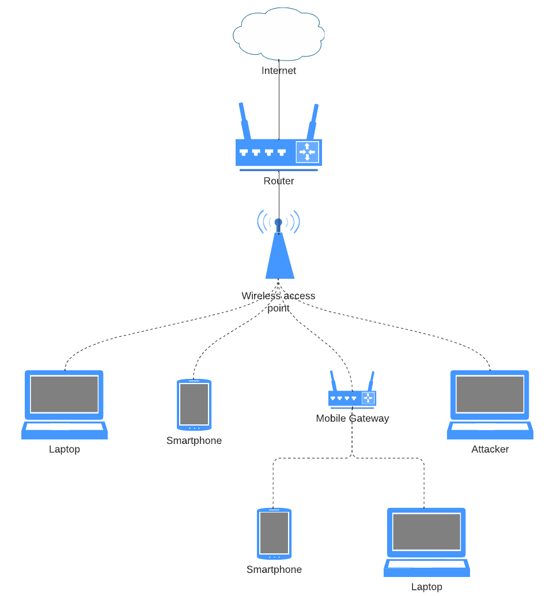
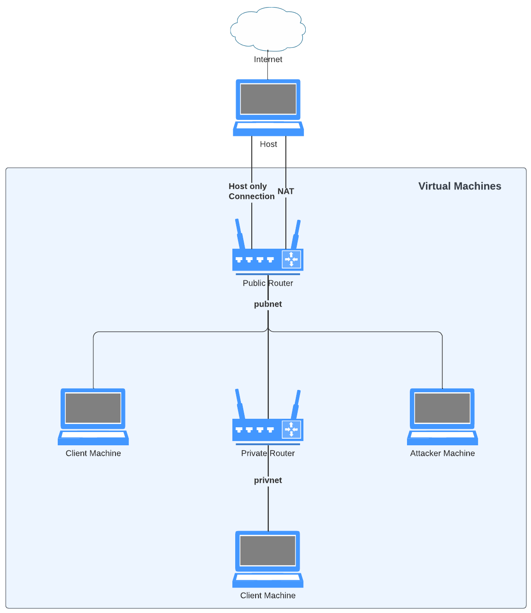

# Intermidiary Gateway in Public Networks Evaluation

Documentation and the Configuration of the project: Intermidiary Gateway in Public Networks Evaluation, which describes how to reproduce the steps of setting up the same network environment, and conduct the same security tests.

## Defense Setup

### Physical Gateway Setup

#### Devices:
1. Raspberry Pi (in our case PI2)
2. Supported USB Wifi Adapter (our case Ralink chipset) (realtek is NOT recommended)
3. micro SD card
4. Router with internet access (and permission to hack it)
5. Ethernet Cable
6. Attack Computer (with wifi)

#### (Ethernet<-o->Wifi) Steps to reproduce:

1. Download *[openwrt image](https://archive.openwrt.org/releases/22.03.5/targets/bcm27xx/)* (for your raspberry pi model)
2. Install *[Raspberry Pi Images](https://www.raspberrypi.com/software/)*
3. Flash the SD card with the openwrt image using raspberry pi imager
4. Connect the powered up raspberrypi to your computer via ethernet (insert sd card into the raspberry pi beforehand)
5. `ssh root@192.168.1.1`
6. `passwd` and type in the new password
7. Add the *[initial network configurations]()* to the /etc/config/network file
8. Edit /etc/config/firewall to change `option input 'REJECT'` to `option input 'ACCEPT'`, which is located below `option name 'wan'`
9. Connect the raspberry pi to the public router through ethernet
10. Get the new ip address with `nmap -sn [x.x.x.x/xx] | grep -B2 raspberry`
11. ssh into the new ip address
12. `opkg update`
13. `opkg install kmod-rt2800-lib kmod-rt2800-usb kmod-rt2x00-lib kmod-rt2x00-usb kmod-usb-core kmod-usb-uhci kmod-usb-ohci kmod-usb2 usbutils openvpn-openssl luci-app-openvpn` to install drivers and other dependencies` (these drivers are specific to ralink)
14. Apply the *[final network configuration]()*
15. Apply the *[wireless configuration]()* located in /etc/config/wireless (if the file doesn't exist, create it)
16. `service network restart`
17. `uci commit wireless`
18. `wifi`
19. Insert the USB Wifi Adapter



### *[Steps](https://openwrt.org/docs/guide-user/virtualization/virtualbox-vm)* to reproduce Virtual Router Setup:
1. Download *[openwrt image](https://archive.openwrt.org/releases/22.03.5/targets/x86/64/openwrt-22.03.5-x86-64-generic-ext4-combined.img.gz)* (for your machine's architecture)
2. `gzip -d openwrt-*.img.gz`
3. `VBoxManage convertfromraw --format VDI openwrt-*.img openwrt.vdi`
4. `VBoxManage modifymedium openwrt.vdi --resize 128`
5. Create a new virtual machine with the openwrt.vdi drive attached
6. Clone this VM to create the virtual public and private routers
7. Attach 3 network adapters to the public router: Host only, NAT and Internal Network pubnet (Host only serves for remote ssh connection from host for headless operation)
8. Attach 2 network adapter (Internal Networks) to the private router: pubnet and privnet
9. Create a kali or parrot VM connected to the Internal Network pubnet
10. Create a windows VM for each pubnet and privnet
11. Apply configurations to the routers



### VPN Setup
#### GUI setup:
<https://protonvpn.com/support/how-to-set-up-protonvpn-on-openwrt-routers/>

#### Setup from the shell
##### Directory Hierarchy
Three files need to be edited (besides the firewall):
- `/etc/openvpn/myvpn.auth`
- `/etc/openvpn/myvpn.ovpn`
- `/etc/config/openvpn
`myvpn` is arbitrary, and can be changed to anything, as long as it matches everywhere.
##### myvpn.auth
This file contains username and password for the vpn connection (both look like hashes, and are seperated by a new line)

##### myvpn.ovpn
This is the downloaded config file from your vpn prvider's download page.
Must be edited:
```
.
.
.
remote-cert-tls server
auth-user-pass /etc/openvpn/myvpn.auth
pull
fast-io
.
.
.
```
This file should be renamed to myvpn.ovpn (change myvpn to anything) and placed in `/etc/openvpn`.

There should be only `auth-user-pass` present, instead of `auth-user-pass /etc/openvpn/myvpn.auth`, so the last part should be added.

##### /etc/config/openvpn
Must contain:
```
config openvpn 'myvpn'
    option config 'etc/openvpn/myvpn.ovpn'
    option enabled '1'
```
The firewall modifications for the vpn are shown in the Firewall Setup section.

### Eliminate *[DNS](https://dnsleaktest.com/)* and *[WebRTC](https://ipleak.net/)* leaks:
Make sure the end device uses the gateway's DNS settings and an up-to-date web browser.

### *[Firewall Setup](https://openwrt.org/docs/guide-user/firewall/firewall_configuration)*:
Replace the firewall configuration file in /etc/config with the one from this repository
#### Firewall Modifications
##### Default
1. Drop crafted packets: `option drop_invalid '1'`
2. SYN flood protection:
    - `option	synflood_protect	'1'`
	- `option	synflood_rate		'25/s'`
	- `option	synflood_burst		'50'`
	- `option	tcp_syncookies		'1'`
##### WAN zone
1. Reject inbound traffic from wan and vpn networks: `option input 'REJECT'`
2. Enable NAT towards this zone: `option masq '1'` (Translates addresses from other zones and presents them to this one)
3. Include `tun0` interface to give access to lan devices (there are other implementations aswell)
    - `list device 'tun0'`
    - `list network 'wan'`
    - `list network 'wan6'`

#### Forwarding
Enable lan zone to have access to the wan zone:
```
config forwarding
    option src 'lan'
    option dest 'wan'
```

## Attack Setup

### Attack Machine

#### Attack Tools


## Security Testing

### Testing and Data Gathering

## Evaluation Methodologies


#### Commands Cheatsheet
- `lsusb`
- `dmesg`
- `cat /sys/kernel/debug/usb/devices`
- `opkg update`
- `opkg install <package>`
- `service network restart`
- `uci show network`
- `uci commit wireless`
- `wifi`
- `iwinfo wlan0 scan`
